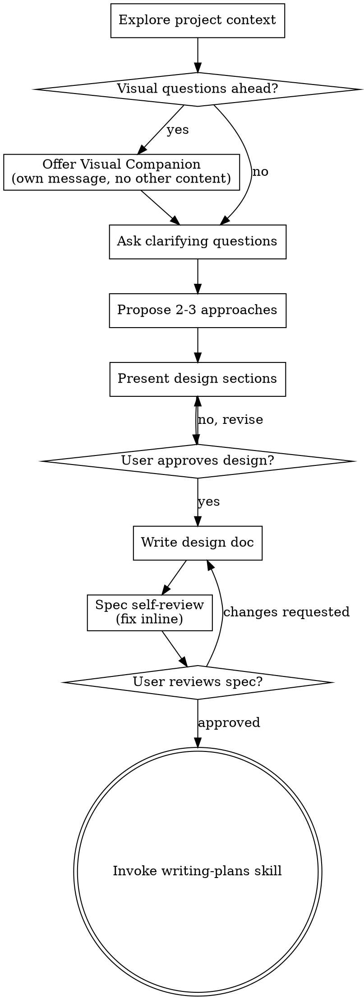

Надо очень быстро написать для презентации текст дял быстрой

Для подписки 

минусы ВК видео - медлленно 

CDN сервера по всей россии и хранилища у нас у ВК ВИДЕО ГОВНО НЕТ все медленно работает 

Мы пришли к вам проадвать у нас сформированная команда мы поможем оптимзиировать ресурсы

У ВК продают рекламу финансовую рекламу и вук проблема что оин увольняют персонал. с финансами проблема отчетность плохая

Мы не хотим просто продавать права на продукт, хотим заниматься B2B берем на работу людей

Мы хотим работать в вк но остались не тольк ов этой апозиции в топовой компании 

на какие уступки мы готовы пойти:
1) Уменьшить цену не больше 20 процентов
2) 50 процентов устроено фоициально 

Кейс 1 Подрядчик
Ситуация: Формальная встреча в компании ВК (подразделение Вконтакте). Вы
пришли продавать новую платформу-аналог ВК видео.
подрядчик
1
Презентующий
Цель: Хочет продать свою новую платформу-аналог ВК
видео. Его знакомый(ая) - HR Business Partner.
подрядчик
2
Член команды
Цель:
подрядчик
3
Член команды
Цель:
подрядчик
4
Член команды
Цель:
подрядчик
5
Член команды
Цель:
подрядчик
6
Член команды
Цель:

Дизайнер Айваз Багаутдинов
Продажник Генадий
Аналитик Сева
Креатор Даша
Директор Ангелина

SKILLS

---
name: brainstorming
description: "You MUST use this before any creative work - creating features, building components, adding functionality, or modifying behavior. Explores user intent, requirements and design before implementation."
---

# Brainstorming Ideas Into Designs

Help turn ideas into fully formed designs and specs through natural collaborative dialogue.

Start by understanding the current project context, then ask questions one at a time to refine the idea. Once you understand what you're building, present the design and get user approval.

<HARD-GATE>
Do NOT invoke any implementation skill, write any code, scaffold any project, or take any implementation action until you have presented a design and the user has approved it. This applies to EVERY project regardless of perceived simplicity.
</HARD-GATE>

## Anti-Pattern: "This Is Too Simple To Need A Design"

Every project goes through this process. A todo list, a single-function utility, a config change — all of them. "Simple" projects are where unexamined assumptions cause the most wasted work. The design can be short (a few sentences for truly simple projects), but you MUST present it and get approval.

## Checklist

You MUST create a task for each of these items and complete them in order:

1. **Explore project context** — check files, docs, recent commits
2. **Offer visual companion** (if topic will involve visual questions) — this is its own message, not combined with a clarifying question. See the Visual Companion section below.
3. **Ask clarifying questions** — one at a time, understand purpose/constraints/success criteria
4. **Propose 2-3 approaches** — with trade-offs and your recommendation
5. **Present design** — in sections scaled to their complexity, get user approval after each section
6. **Write design doc** — save to `docs/superpowers/specs/YYYY-MM-DD-<topic>-design.md` and commit
7. **Spec self-review** — quick inline check for placeholders, contradictions, ambiguity, scope (see below)
8. **User reviews written spec** — ask user to review the spec file before proceeding
9. **Transition to implementation** — invoke writing-plans skill to create implementation plan

## Process Flow

**The terminal state is invoking writing-plans.** Do NOT invoke frontend-design, mcp-builder, or any other implementation skill. The ONLY skill you invoke after brainstorming is writing-plans.

## The Process

**Understanding the idea:**

- Check out the current project state first (files, docs, recent commits)
- Before asking detailed questions, assess scope: if the request describes multiple independent subsystems (e.g., "build a platform with chat, file storage, billing, and analytics"), flag this immediately. Don't spend questions refining details of a project that needs to be decomposed first.
- If the project is too large for a single spec, help the user decompose into sub-projects: what are the independent pieces, how do they relate, what order should they be built? Then brainstorm the first sub-project through the normal design flow. Each sub-project gets its own spec → plan → implementation cycle.
- For appropriately-scoped projects, ask questions one at a time to refine the idea
- Prefer multiple choice questions when possible, but open-ended is fine too
- Only one question per message - if a topic needs more exploration, break it into multiple questions
- Focus on understanding: purpose, constraints, success criteria

**Exploring approaches:**

- Propose 2-3 different approaches with trade-offs
- Present options conversationally with your recommendation and reasoning
- Lead with your recommended option and explain why

**Presenting the design:**

- Once you believe you understand what you're building, present the design
- Scale each section to its complexity: a few sentences if straightforward, up to 200-300 words if nuanced
- Ask after each section whether it looks right so far
- Cover: architecture, components, data flow, error handling, testing
- Be ready to go back and clarify if something doesn't make sense

**Design for isolation and clarity:**

- Break the system into smaller units that each have one clear purpose, communicate through well-defined interfaces, and can be understood and tested independently
- For each unit, you should be able to answer: what does it do, how do you use it, and what does it depend on?
- Can someone understand what a unit does without reading its internals? Can you change the internals without breaking consumers? If not, the boundaries need work.
- Smaller, well-bounded units are also easier for you to work with - you reason better about code you can hold in context at once, and your edits are more reliable when files are focused. When a file grows large, that's often a signal that it's doing too much.

**Working in existing codebases:**

- Explore the current structure before proposing changes. Follow existing patterns.
- Where existing code has problems that affect the work (e.g., a file that's grown too large, unclear boundaries, tangled responsibilities), include targeted improvements as part of the design - the way a good developer improves code they're working in.
- Don't propose unrelated refactoring. Stay focused on what serves the current goal.

## After the Design

**Documentation:**

- Write the validated design (spec) to `docs/superpowers/specs/YYYY-MM-DD-<topic>-design.md`
  - (User preferences for spec location override this default)
- Use elements-of-style:writing-clearly-and-concisely skill if available
- Commit the design document to git

**Spec Self-Review:**
After writing the spec document, look at it with fresh eyes:

1. **Placeholder scan:** Any "TBD", "TODO", incomplete sections, or vague requirements? Fix them.
2. **Internal consistency:** Do any sections contradict each other? Does the architecture match the feature descriptions?
3. **Scope check:** Is this focused enough for a single implementation plan, or does it need decomposition?
4. **Ambiguity check:** Could any requirement be interpreted two different ways? If so, pick one and make it explicit.

Fix any issues inline. No need to re-review — just fix and move on.

**User Review Gate:**
After the spec review loop passes, ask the user to review the written spec before proceeding:

> "Spec written and committed to `<path>`. Please review it and let me know if you want to make any changes before we start writing out the implementation plan."

Wait for the user's response. If they request changes, make them and re-run the spec review loop. Only proceed once the user approves.

**Implementation:**

- Invoke the writing-plans skill to create a detailed implementation plan
- Do NOT invoke any other skill. writing-plans is the next step.

## Key Principles

- **One question at a time** - Don't overwhelm with multiple questions
- **Multiple choice preferred** - Easier to answer than open-ended when possible
- **YAGNI ruthlessly** - Remove unnecessary features from all designs
- **Explore alternatives** - Always propose 2-3 approaches before settling
- **Incremental validation** - Present design, get approval before moving on
- **Be flexible** - Go back and clarify when something doesn't make sense

## Visual Companion

A browser-based companion for showing mockups, diagrams, and visual options during brainstorming. Available as a tool — not a mode. Accepting the companion means it's available for questions that benefit from visual treatment; it does NOT mean every question goes through the browser.

**Offering the companion:** When you anticipate that upcoming questions will involve visual content (mockups, layouts, diagrams), offer it once for consent:
> "Some of what we're working on might be easier to explain if I can show it to you in a web browser. I can put together mockups, diagrams, comparisons, and other visuals as we go. This feature is still new and can be token-intensive. Want to try it? (Requires opening a local URL)"

**This offer MUST be its own message.** Do not combine it with clarifying questions, context summaries, or any other content. The message should contain ONLY the offer above and nothing else. Wait for the user's response before continuing. If they decline, proceed with text-only brainstorming.

**Per-question decision:** Even after the user accepts, decide FOR EACH QUESTION whether to use the browser or the terminal. The test: **would the user understand this better by seeing it than reading it?**

- **Use the browser** for content that IS visual — mockups, wireframes, layout comparisons, architecture diagrams, side-by-side visual designs
- **Use the terminal** for content that is text — requirements questions, conceptual choices, tradeoff lists, A/B/C/D text options, scope decisions

A question about a UI topic is not automatically a visual question. "What does personality mean in this context?" is a conceptual question — use the terminal. "Which wizard layout works better?" is a visual question — use the browser.

If they agree to the companion, read the detailed guide before proceeding:
`skills/brainstorming/visual-companion.md`

Вот оформленный текст для презентации:

---

# Коммерческое предложение: Платформа видеохостинга для ВКонтакте

## О нас

Мы — сформированная команда специалистов, готовая предложить ВКонтакте современную альтернативу текущей платформе ВК Видео. В нашу команду входят:

- **Ангелина** — директор проекта
    
- **Геннадий** — продажи и развитие бизнеса
    
- **Всеволод** — аналитика и данные
    
- **Дарья** — контент и креатив
    
- **Айваз** — дизайн и интерфейс
    

---

## Проблема

ВК Видео сегодня испытывает серьёзные технические и операционные трудности:

- **Медленная работа** — отсутствует распределённая CDN-инфраструктура по всей России, что приводит к низкой скорости загрузки и воспроизведения контента
    
- **Слабая инфраструктура хранилищ** — текущие решения не справляются с нагрузкой
    
- **Финансовые сложности** — непрозрачная отчётность, сокращение персонала, проблемы с монетизацией рекламы
    

---

## Наше решение

Мы предлагаем готовую платформу — полноценный аналог ВК Видео с:

- Распределёнными CDN-серверами по всей территории России
    
- Надёжными и масштабируемыми хранилищами данных
    
- Быстрой скоростью загрузки и стриминга
    

---

## Формат сотрудничества

Мы не просто продаём лицензию на продукт. Мы предлагаем **полноценное B2B-партнёрство**:

- Берём на себя операционное сопровождение
    
- Трудоустраиваем команду официально (50% сотрудников оформлены официально)
    
- Помогаем оптимизировать ресурсы и снизить операционные издержки
    
- Нацелены на долгосрочное сотрудничество внутри экосистемы ВКонтакте
    

---

## Условия и готовность к переговорам

Мы открыты к диалогу и готовы на следующие уступки:

- **Скидка до 20%** от базовой стоимости
    
- Гибкие условия оформления команды
    

---

## Почему мы?

Мы пришли не как разовые подрядчики — мы хотим работать **внутри экосистемы ВК** на постоянной основе, занимая стратегическую позицию в одной из топовых технологических компаний России.

**1. Гипотезы**

**Гипотеза 1: родители готовы систематически загружать данные и видео, если увидят объективную обратную связь и возможность сравнения с другими игроками**

**Содержание:**  
Родители испытывают потребность в объективных критериях оценки прогресса ребёнка и готовы тратить время на внесение антропометрии, загрузку видео и прохождение тестов, если платформа даёт прозрачные метрики, сравнительный рейтинг и конкретные рекомендации по развитию.

**Критерии подтверждения:**

- Высокий уровень заполнения профилей после регистрации (>70% пользователей заполняют основные поля и загружают хотя бы одно видео в первую неделю).
- Положительные отзывы родителей о ценности сравнительных данных («увидели, в чём отстаём от сверстников. Наводим правильный вектор в развитии физических данных»).
- Повторные загрузки видео (например, раз в 2–3 месяца) как индикатор удержания.

**Гипотеза 2: Спортивные академии  или спортивные секции заинтересованы в использовании платформы как инструмента поиска талантов, если в ней будет накоплена критическая масса качественных данных**

**Содержание:**  
Селекционная служба и академии испытывают дефицит объективной информации об игроках из отдалённых регионов и готовы переходить на цифровой инструмент вместо «сарафанного радио» и точечных просмотров. Ключевым стимулом становится не просто база данных, а возможность фильтрации по объективным параметрам (скоростно-силовые, техника катания, результативность) с подтверждением видеофрагментами.

**Критерии подтверждения:**

- Наличие подтверждённого интереса со стороны минимум 1-3 академий или селекционных служб на этапе прототипа (письма о намерениях, участие в пилотном тестировании).
- Готовность платить за расширенный доступ (B2B-модель) или предоставлять партнёрские ресурсы (интеграция, экспертная оценка).

**Гипотеза 3: Интеграция с крупными детскими турнирами является наиболее эффективным каналом привлечения родителей и игроков на старте**

**Содержание:**  
Турниры (например, «Сибириус») собирают большое количество родителей из разных регионов в одном месте и в сжатые сроки, что создаёт эффект «воронки»: родители видят конкурентов, у них возникает потребность в объективной оценке, и они готовы регистрироваться на платформе «здесь и сейчас». Офлайн-активности (промо-стенды, тестовые замеры) в связке с цифровым онбордингом дают более высокую конверсию, чем только онлайн-реклама.

**Критерии подтверждения:**

- Конверсия в регистрацию на турнире >15% от числа контактировавших родителей.
- Увеличение числа загрузок видео после турнира (родители снимают выступления и хотят получить анализ).
- Положительный NPS среди участников пилотного продвижения на турнире. (**NPS (Net Promoter Score)** — индекс лояльности.  
    «Положительный NPS» означает, что среди опрошенных родителей, которые участвовали в продвижении на турнире, больше тех, кто готов рекомендовать платформу другим, чем тех, кто дал низкие оценки. Это признак того, что пилотное взаимодействие прошло успешно.)

  

**2. Целевая аудитория (ЦА)**

**Сегмент 1. Родители юных хоккеистов**

- **Возраст детей:** преимущественно 5–12 лет (период активного развития и поиска «правильного» пути).
- **География:** Омская, Ленинградская области (пилот), затем — вся Россия, с акцентом на регионы, удалённые от столичных академий.
- **Мотивация:** желание объективно оценить перспективы ребёнка, получить признание его прогресса, быть замеченным скаутами, снизить тревожность («правильно ли мы занимаемся»).
- **Боли:** отсутствие прозрачных критериев оценки; траты на ненужные сборы и экипировку без понимания реального потенциала; невозможность сравнить своего ребёнка с ровесниками из других городов.

**Сегмент 2. Тренерский штаб и менеджмент хоккейных академий**

- **Роли:** главные тренеры, селекционеры, спортивные директора.
- **Задачи:** поиск талантливых игроков, мониторинг прогресса, стандартизация отбора, снижение субъективизма.
- **Боли:** сложность оценки игроков из других регионов; разрозненность данных; высокая конкуренция за перспективных детей, которых «перехватывают» без объективных оснований; нехватка инструментов для дистанционной работы с родителями.

**Сегмент 3. Партнёры (турниры, школы, спортивные сайты)**

- **Турниры:** заинтересованы в повышении собственной привлекательности, внедрении цифровых сервисов для участников.
- **Хоккейные школы и академии (в перспективе):** могут использовать платформу как внутренний инструмент контроля развития игроков.
- **Инфопартнёры (**[**KidsHockey.ru**](https://kidshockey.ru/)**, AirHockey и др.):** заинтересованы в уникальном контенте (рейтинги, аналитика) и повышении вовлечённости аудитории.

  

**3. Валидация идей**

**Методы и инструменты валидации**

|   |   |   |
|---|---|---|
|Идея / Гипотеза|Метод валидации|Критерий успеха|
|**Гипотеза 1 (родители готовы загружать данные)**|1. Интервью с родителями (10–15 человек) по методике Jobs To Be Done.   2. MVP-тест: создание лендинга с формой загрузки видео и тестов. Запуск таргетированной рекламы на родителей в Омской и Ленинградской областях.   3. Анализ поведения в прототипе (воронка регистрации далее загрузка данных).|Доля заполнивших профиль полностью ≥60%; доля загрузивших видео ≥40% от зарегистрировавшихся. Положительная обратная связь в интервью о ценности сравнения и рекомендаций.|
|**Гипотеза 2 (интерес академий и скаутов)**|1. Глубинные интервью с представителями 5–7 академий / селекционных служб.   2. Проведение вебинара с демо-версией прототипа для потенциальных B2B-клиентов.   3. Заключение пилотных соглашений на тестирование платформы в период ППМ-2.|Минимум 3 академии выражают готовность участвовать в пилотном тестировании. Фиксация конкретных требований к функционалу (фильтры, экспорт данных, интеграция с существующими системами).|
|**Гипотеза 3 (эффективность турниров как канала)**|1. Участие в одном из детских турниров (например, «Сибириус» или аналогичном в Омской/Ленинградской обл.) с промо-стендом, проведением бесплатных замеров (скорость катания, техника).   2. Сравнение конверсии: офлайн-промо + QR-код на регистрацию  против чисто онлайн-кампания.   3. Опрос участников турнира о мотивациирегистрации.|Конверсия в регистрацию на турнире выше на 30–50% по сравнению с онлайн-кампанией с аналогичным бюджетом. Доля родителей, назвавших «возможность сравнить с другими участниками турнира» как ключевой мотив, >40%.|

**Дополнительные способы валидации ЦА и функциональных требований**

- **Количественный опрос родителей** (через паблики [KidsHockey.ru](https://kidshockey.ru/), группы академий) для проверки гипотез о ценности видеоанализа и готовности платить (даже символическую сумму).
- **A/B-тестирование прототипа** с разными вариантами интерфейса для оценки понятности и времени выполнения ключевых сценариев (добавление игрока, загрузка видео, просмотр рекомендаций).
- **Экспертные интервью с тренерами и методистами** для валидации эталонных упражнений и критериев оценки техники (чтобы система компьютерного зрения изначально базировалась на корректных хоккейных стандартах).
  
  

[3/24/26 7:25 AM] Katia: Всем привет! 

Артём ознакомился с отправленными материалами по футболу и оставил комментарии. Сейчас перешлю их для изучения. 

Также позже уточню список задач на эту и следующую неделю и сообщу 😌
[3/24/26 7:25 AM] Katia: Доброе утро. Система умных камер вещь интересная, но она стационарная, поэтому не следует ее использовать. Больше- приложение.
[3/24/26 7:25 AM] Katia: Из приложения Juni stat можно однозначно взять оценку техники по основным точкам - система умных тестов.
[3/24/26 7:25 AM] Katia: Добавить - общую анкету на игрока, возможность загрузки видео, обрезки на фрагменты и возможность осуществлять раскадровку и рисование прямо в видео, добавление встреч - для назначения видеоконференции, чат с родителем, раздел медицины, психологии. Отдельно сделать достижения.
[3/24/26 7:25 AM] Katia: распространять можно через сайт: https://trackhockey.ru/
[3/24/26 7:25 AM] Katia: раздел прогресса игрока, возможность отслеживать в динамике показатели соревновательной деятельности, тестирований по общей и специальной подготовке.
[3/24/26 7:25 AM] Katia: Общая текстовая характеристика игрока - амплуа, рост, вест, хват, ролевая модель, сильные и слабые стороны, дополнительные сведения
[3/24/26 7:25 AM] Katia: возможность в чат с родителем или ребенком добавлять файлы формата PDF или PNG/JPG
[3/24/26 7:25 AM] Katia: https://icoachkids.org/courses
[3/24/26 7:25 AM] Katia: Отсюда можно взять курсы для раздела обучение
[3/24/26 7:25 AM] Katia: для родителей, которые видят в ребенке спортсмена
[3/24/26 7:25 AM] Katia: https://apps.microsoft.com/detail/9wzdncrdmvjs?hl=ru-RU&gl=RU
[3/30/26 1:54 PM] Katia: Всем привет! 

Я уточняла про задачи на ближайшее время:

• загрузка в Moodle
• старт задач

В Moodle я всё загрузила. Также начался этап исследований:

-разработка гипотез
-план их проверки
-описание целевой аудитории
-формулирование проблемы и решения

Меня не будет в четверг. Задачи на эту неделю уже выполнены, судя по документу от Маши. Если что можем дополнять друг друга по ходу

Пожалуйста, расскажите потом, что обсуждали в четверг. После этого распределим следующие задачи и свяжемся с заказчиком, чтобы уточнить вопросы и пожелания

